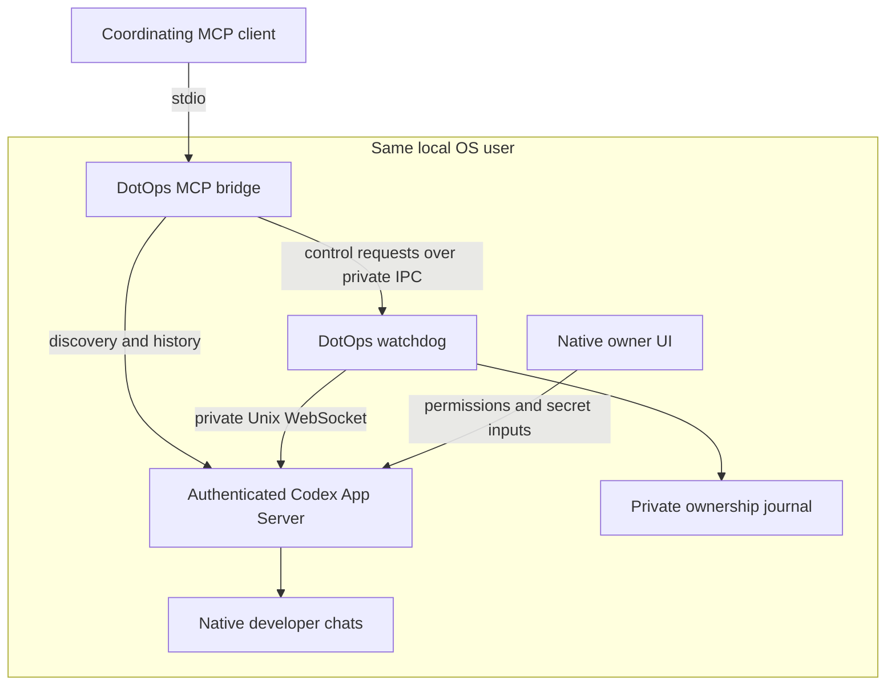

# DotOps

[Source](https://github.com/Dlybeck/dotops) ·
[MIT license](LICENSE) · [Installation](docs/INSTALLATION.md) ·
[Troubleshooting](docs/TROUBLESHOOTING.md)

DotOps connects a coordinating conversation to local native Codex developer chats.
Discover chats, read bounded latest-first history, create or enroll a local chat,
send or steer requests, retrieve results and ordinary questions, and stop exact
recorded work. Direct developer-chat interaction is optional for ordinary work.

Native settings, accounts, model/provider selection, sandbox and permissions stay
native. DotOps adds no work windows, message-count limits, timed automatic stops,
required personas or skills. Delivery acknowledgement, running work, completion,
failure and uncertainty are separate states.

## Who this is for

Developers already using Codex locally who want an MCP-capable client to
coordinate native chats while retaining native settings and permission controls.
This experimental integration currently targets Linux; safe fixture verification
is available without a Codex account, while live use needs a compatible native
server setup.

## How it fits together



The MCP client launches the bridge; you run the watchdog separately. The journal
retains ownership metadata, not prompt bodies. Native approvals stay in the owner
UI. Optional context and skills require explicit configuration or selection.

## Quickstart: install and run safe tests

This initial source release targets **Linux and Node 22** (22.23.3 is pinned in
`.node-version`), with `/usr/bin/flock` and accessible `/proc/self/fd`.
The fixture tests require no Codex account,
credentials or native daemon. Live use requires an already authenticated local
Codex App Server with the required experimental APIs and Unix WebSocket socket.

```sh
git clone https://github.com/Dlybeck/dotops.git
cd dotops
node --version
test -x /usr/bin/flock
npm ci --ignore-scripts
npm test
```

The tests use temporary journals, sockets and native fixtures. They do not send
real model requests, grant native approvals or restart live services.
See [installation and MCP configuration](docs/INSTALLATION.md) before live use.
The package keeps its legacy `codex-dot-connector` name and `private: true`; this
is a source release, not an npm package publication.

## Live setup: connect a coordinating client

Before continuing, authenticate Codex through its native client and confirm that
your installation exposes the compatible local control socket. **This repository
does not provide a verified universal native-server/socket bootstrap.** An
ordinary stdio-only App Server does not satisfy this transport requirement.
See [native prerequisites and setup boundaries](docs/INSTALLATION.md#native-server-prerequisite).

For a new installation, run one control process from this checkout:

```sh
node src/stage1/watchdog.mjs --access-mode user-directories
```

Then configure an MCP client to launch `node` with the absolute path to
`src/expanded/server.mjs`, using stdio. The watchdog and bridge share the default
private journal/socket under `$HOME/Projects/codex-dot-connector/var/stage1`.
The existing native socket is
`$HOME/.codex/app-server-control/app-server-control.sock`. DotOps does not start
or reconfigure the native daemon. If a watchdog already owns that journal, review
its deployment before replacing it; never start a second writer.

This command runs in the foreground; it does not install a background service.
Remote clients need a separately configured supported transport or tunnel; DotOps
does not provision one. Keep native/control sockets private. See
[remote and background operation](docs/INSTALLATION.md#remote-and-background-operation).

For discovery and history alone, use `src/server.mjs`. `npm start` launches that
entrypoint, not a watchdog. Expanded control supports accessible canonical local
directories, including non-Git folders, after explicit creation/enrollment.
Legacy Stage1 retains restricted project-directory and descendant-tree safeguards.

## First request

1. Call `codex_chat_create` with a fresh UUID `requestId`, canonical absolute
   `repository` directory and `title`. This creates a chat without a model turn.
2. Read `codex_chat_status` for the returned `threadId`.
3. Call `codex_chat_send` with a stable UUID `requestId`, that `threadId`, `text`,
   the status `latestTurnId` as `expectedLastTurnId` (null when empty), and
   `acknowledgeConcurrentStartRisk: true`.
4. Inspect status and bounded history for delivery and results. Unknown delivery
   requires reconciliation; reuse the same request ID instead of duplicating work.
5. Steer with the exact recorded `expectedTurnId`; stop with the exact owned
   `turnId`. A stop acknowledgement is separate from verified closure.

Optional private context is empty by default. The `developer` field supplies
project context to the first observed-empty chat request; `tpm` supplies context
for the coordinating caller to review before sending. Fill a private copy of
the blank `context.example.json` and select it with `--context-file`; see
[configuration and delivery details](docs/CONTEXT-DELIVERY.md).
If TPM context is configured, send first returns preparation without delivery;
review it and use its `preparationId` with a new send request ID. See
[skill invocation](docs/SKILL-INVOCATION.md) and
[the full coordinating flow](docs/COORDINATING-FLOW.md). No skill package is required.

## Safety and validation limits

Expanded mode tracks exact accepted model, command-process, delegation and
continuation obligations. A terminal model closes that model only. Live owned
processes and missing/conflicting evidence remain blocking. A later manual turn
is unowned: it can make the target busy without reopening earlier closed work.

An authenticated coordinating-UI native approval bridge is **not implemented**.
Native approvals and secret inputs require the supported native owner UI; model
text and ordinary question answers are not owner consent. Native check-and-start
is non-atomic. Tracked command leader exit does not guarantee that all detached
OS descendants stopped. Ambiguous delegation grants no child-stop authority.

The current candidate passes **398 fixture tests**. The earlier restored source
passed four bounded native core scenarios:
start/steer/replay/completion, owned command stop/reconnect, attributable delegation
completion/reconnect/subsequent start, and later unowned work blocking admission
while earlier own-stop remains verified. Actual **child unload was not observed**;
that subcase remains fixture-backed. This is not production activation or
universal compatibility evidence. The goal privacy/closure fixes atop that source
have fixture coverage; no new live/client acceptance is claimed for them.
See [validation](docs/VALIDATION.md),
[the release contract](docs/RELEASE-CONTRACT.md),
[native approval integration](docs/APPROVAL-INTEGRATION.md) and [security](SECURITY.md).

## License and contributions

Copyright (c) 2026 David Lybeck. Released under [MIT](LICENSE), including commercial
use. Preserve the [dependency notices](THIRD-PARTY-NOTICES.md).
See [contributing](CONTRIBUTING.md). Report ordinary bugs through
[GitHub issues](https://github.com/Dlybeck/dotops/issues); keep credentials and
private native transcripts out of public reports.
