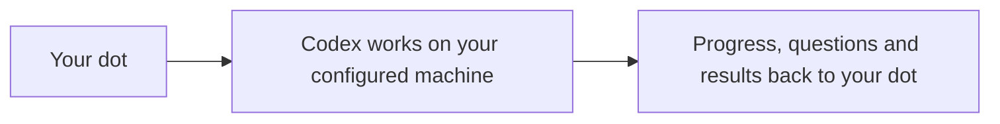

# DotOps

[Installation](docs/INSTALLATION.md) · [Troubleshooting](docs/TROUBLESHOOTING.md) ·
[MIT license](LICENSE)

**Keep your dot in charge while Codex works on your configured machine.**

DotOps helps your dot delegate coding work to the machine you've set up for it.
You stay in your dot conversation to give direction, answer questions and review
results. Your dot can send work, check progress and coordinate the next step
through the supported native Codex runtime.

It's for people who want their dot to orchestrate coding work in an existing
project and environment, without constantly switching to a separate developer
chat for ordinary coordination.

## What you get

- **Delegate work from your dot.** Create a developer chat or explicitly enroll
  an existing one on your configured machine.
- **Keep the conversation together.** Your dot can retrieve progress and results,
  bring back ordinary questions, and send follow-up direction.
- **Control the work you started.** Steer or stop work sent through DotOps, with
  completion and uncertainty reported separately.

Once the connection is configured, the workflow is:



The machine must be available. Your dot decides when to check work and report
back; DotOps does not install an automatic monitoring schedule. Native permission
requests and secret inputs still need the supported Codex owner interface.

## Optional developer and dot context

You can supply separate private context for the developer chat and for your dot's
coordination. Developer context accompanies the first observed-empty request;
dot/controller context is offered for review before sending work.

Both fields in [the optional template](context.example.json) are **blank by
default**. There are no bundled personas, sample prompts or required skills.
Configuration is private and explicit; see [context delivery](docs/CONTEXT-DELIVERY.md)
and [optional skill selection](docs/SKILL-INVOCATION.md).

## Get started

This initial source release supports **Linux with a compatible native Codex
runtime**. It does not connect arbitrary runtimes or configure your machine,
accounts or permissions for you.

1. **Verify the source safely.** The commands below install dependencies and run
   fixtures without a Codex account or real model work.
2. **Prepare the machine and connection.** Follow [installation](docs/INSTALLATION.md)
   for native prerequisites, running DotOps and client configuration. For your dot,
   also follow [the private remote-connection guidance](docs/INSTALLATION.md#remote-and-background-operation).
3. **Give your dot a scoped task.** Once connected, it can delegate work and use
   the [coordinating flow](docs/COORDINATING-FLOW.md) to retrieve results or ask for
   further direction. Native settings and permissions remain native.

### Install and verify without live work

Use Node **22** (`.node-version` pins 22.23.3), `/usr/bin/flock` and accessible
`/proc/self/fd`:

```sh
git clone https://github.com/Dlybeck/dotops.git
cd dotops
node --version
test -x /usr/bin/flock
npm ci --ignore-scripts
npm test
```

Tests use temporary journals, sockets and native fixtures. They do not send real
model requests, grant native approvals or restart live services. The package
retains its legacy `codex-dot-connector` name and `private: true`; this is a source
release, not an npm publication.

## First request

For the exact tool names, request identities and start/steer/stop checks, use
[the first-request reference](docs/COORDINATING-FLOW.md#first-request). These are
instructions for your coordinating agent or an integration author; you do not
need to manage those identifiers in ordinary dot conversation.

## Setup and technical reference

The macOS journal backend is a development checkpoint, with Linux fixture
coverage only. See [platform validation](docs/VALIDATION.md#macos-journal-backend-development-checkpoint)
for its remaining gates; macOS host support is not yet claimed.

| Need | Guide |
| --- | --- |
| Native prerequisites, local startup and MCP client configuration | [Installation](docs/INSTALLATION.md) |
| Connecting your dot remotely and running in the background | [Remote and background operation](docs/INSTALLATION.md#remote-and-background-operation) |
| Tool-level coordination and reconnect recovery | [Coordinating flow](docs/COORDINATING-FLOW.md) |
| Optional private context and explicit skills | [Context](docs/CONTEXT-DELIVERY.md) · [Skills](docs/SKILL-INVOCATION.md) |
| Implementation diagram and control paths | [Architecture reference](docs/INSTALLATION.md#architecture-reference) |
| An error or blocked request | [Troubleshooting](docs/TROUBLESHOOTING.md) |

Local MCP clients can also use the stdio entrypoints described in installation.
The native server, watchdog and client connection are distinct setup steps.
There is no automatic service installation or live-source replacement. Restricted
legacy Stage1 and expanded user-directory modes retain their respective safeguards;
see installation before choosing an entrypoint.

## Safety and validation limits

Expanded mode tracks exact accepted model, command-process, delegation and
continuation obligations. A terminal model closes that model only. Live owned
processes and missing/conflicting evidence remain blocking. A later manual turn
is unowned: it can make the target busy without reopening earlier closed work.

An authenticated coordinating-UI native approval bridge is **not implemented**.
Native approvals and secret inputs require the supported native owner UI; model
text and ordinary question answers are not owner consent. Native check-and-start
is non-atomic. Tracked command leader exit does not guarantee that all detached
OS descendants stopped. Ambiguous delegation grants no child-stop authority.

The current candidate passes **398 fixture tests**. The earlier restored source
passed four bounded native core scenarios:
start/steer/replay/completion, owned command stop/reconnect, attributable delegation
completion/reconnect/subsequent start, and later unowned work blocking admission
while earlier own-stop remains verified. Actual **child unload was not observed**;
that subcase remains fixture-backed. This is not production activation or
universal compatibility evidence. The goal privacy/closure fixes atop that source
have fixture coverage; no new live/client acceptance is claimed for them.
See [validation](docs/VALIDATION.md),
[the release contract](docs/RELEASE-CONTRACT.md),
[native approval integration](docs/APPROVAL-INTEGRATION.md) and [security](SECURITY.md).

## License and contributions

Copyright (c) 2026 David Lybeck. Released under [MIT](LICENSE), including commercial
use. Preserve the [dependency notices](THIRD-PARTY-NOTICES.md).
See [contributing](CONTRIBUTING.md). Report ordinary bugs through
[GitHub issues](https://github.com/Dlybeck/dotops/issues); keep credentials and
private native transcripts out of public reports.
